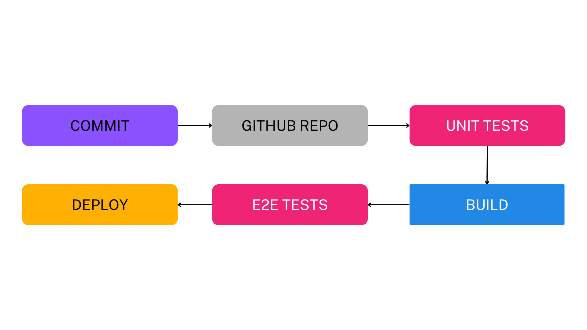

# BookWorms project
## Where can I see the site?
### https://bookworms.fly.dev

## Use-Cases
- Visit the website
- Check the books
- Apply for a book
- Confirmation of application by email
- Registration after acceptance of the letter of motivation
- Log in / Log out
- Bid on a book 
- Change user information
- Change book information (Admin)
- Change bid date  (Admin)
- Confirm the letter of motivation (Admin)

## Technologies
- [Vue](https://vuejs.org/) + [TypeScript](https://www.typescriptlang.org/) (Frontend)
- [NestJS](https://nestjs.com/) + [TypeScript](https://www.typescriptlang.org/) (Backend)
- [Turso](https://turso.tech/) (Database)
- [Fly.io](https://fly.io/) (Deploy)
- [Brevo](https://www.brevo.com/) (Sending Emails)
- Github Actions (CI/CD)

## How to run locally?
### Preparation
- In the backend folder make a file `.env`  with this line:
`JWT_SECRET=your JWT secret`

- In the backend folder make a file `.env.localdev` with these lines:   
`DATABASE_URL=your Turso database URL`  
`DATABASE_TOKEN=your Turso database TOKEN`  
`PAGE_URL=http://localhost:3000/`   
`BREVO_API_KEY=your Brevo API key`

### Frontend
cd frontend  
npm ci  
npm run build:localdev

### Backend

cd backend  
npm ci  
npm run start:localdev